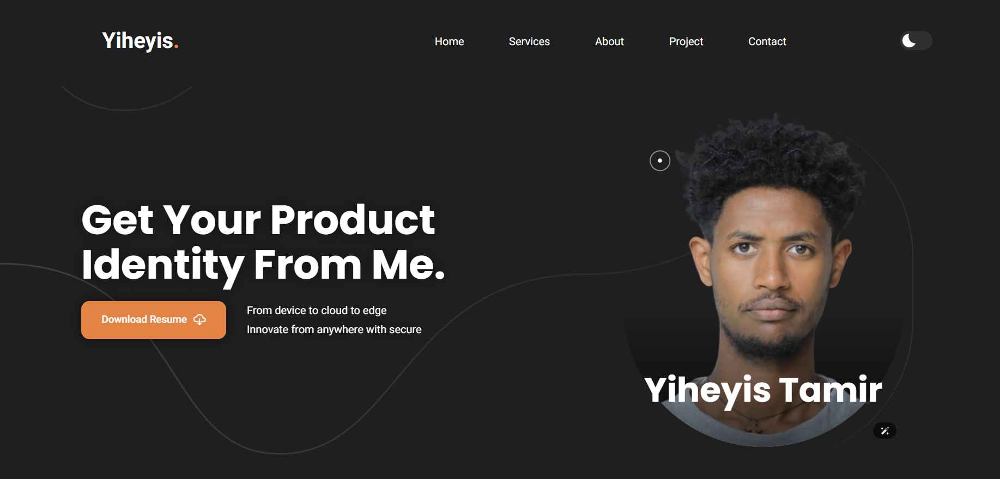
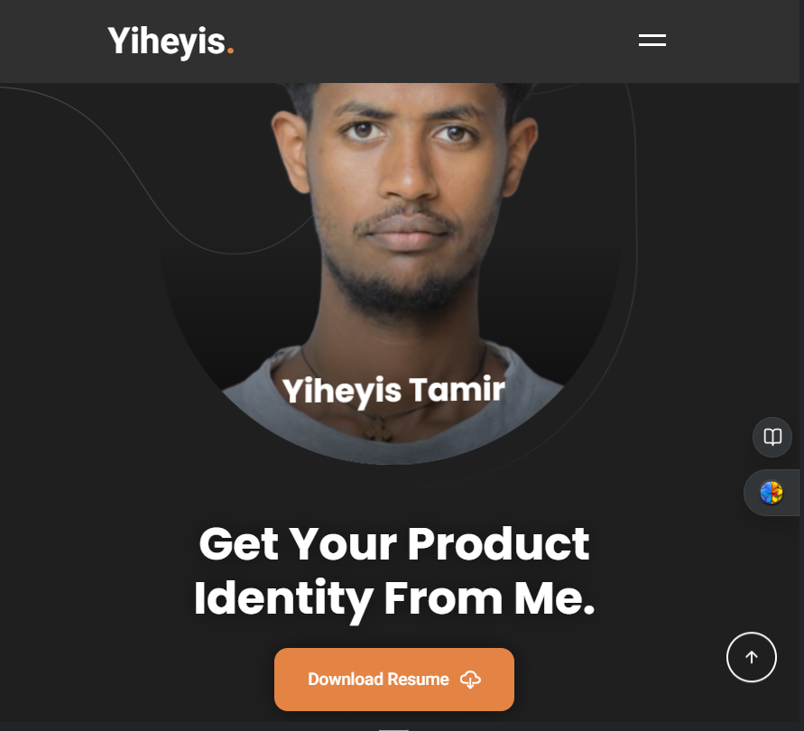

<div align="center">

  
  
  


  <br />
  <br />
<h2 align="center"> Yiheyis - Personal Portfolio Website </h2>

This is a fully responsive personal portfolio website, built using <strong>HTML, CSS, and JavaScript</strong>. This project showcases my skills, projects, and contact information in a clean and professional manner.
<br>
<br>
<a href="https://yiheyis-portfolio.vercel.app/"><strong>➥ Live Demo</strong></a>

</div>

## Table of Contents

- [Features](#features)
- [Screenshots](#screenshots)
- [Technologies Used](#technologies-used)
- [Setup](#setup)
- [License](#license)

## Features

- Fully responsive design
- Modern and clean layout
- Smooth scrolling
- Interactive elements
- Contact form

## Screenshots




## Technologies Used

- HTML
- CSS
- JavaScript

## Setup

To run this project locally, follow these steps:

1. Clone the repository:
    ```sh
    git clone https://github.com/Yiheyistm/yiheyis_portfolio.git
    ```
2. Navigate to the project directory:
    ```sh
    cd yiheyis_portfolio
    ```
3. Open `index.html` in your browser to view the website.

## Maintenance

- Update resume: replace the PDF in `other/` and ensure the link in `index.html` points to it.
- Projects: the Projects section fetches latest public repos from GitHub automatically. To curate, edit `assets/js/script.js` in `initProjects()` to filter, map banners, or pin.
- Tech Stack: auto-generated from repo languages plus a small manual list in `initTechStack()`; adjust the manual array to add/remove technologies.
- Certificates: edit the `certificates` array in `initCertificates()` inside `assets/js/script.js`. Use public Google Drive links; previews require the file to be shared “Anyone with the link: Viewer”.
- Social links: update URLs in the Contact section of `index.html`.

Notes:
- If GitHub API rate limits you on a fresh load, the page will fallback to two example projects. Refresh later or serve the site from a domain to improve caching.
- Google Drive thumbnails depend on visibility. If thumbnails don’t appear, the “Open …” button still opens the certificate in a new tab.

## License

This project is **free to use** and does not contains any license.
